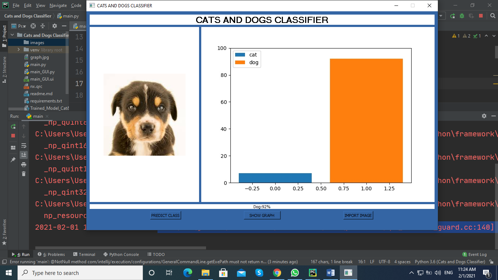
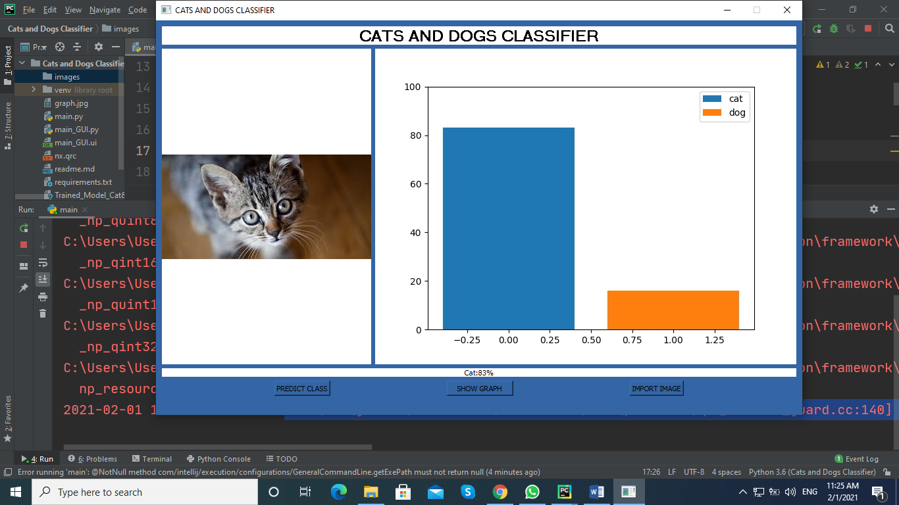

# Classifying Cats and Dogs from images using Neural Networks
Introduction 

The aim of this project is to use Deep Learning as a tool to correctly classify images of cats and dogs, using a subset of the Asirra dataset. To foster a good understanding, and appreciate some Deep Learning techniques and models, the project report has been drafted such that, every new experiment leads to an incremental growth in performance, compared to the previous experiment.

For setting up the project first you need to run the following command

* Step 1
```
pip install -r requirements.txt
``` 
* Step 2
```
python main.py
```

Setup 
The experiments in this project were carried out using the following hardware and software packages. 
#### Software
*	Keras 1.1.2
*	Theano 0.9.0.dev4 
*	Python 2.7 
#### Hardware
*	Processor: Intel Core i7-6700HQ (2.6 GHz)  
*	RAM:  16GB DDR4 
*	GPU:   Nvidia GTX 1060 6GB 

#### Screen Shots


Predicting dog



Predicting Cat
